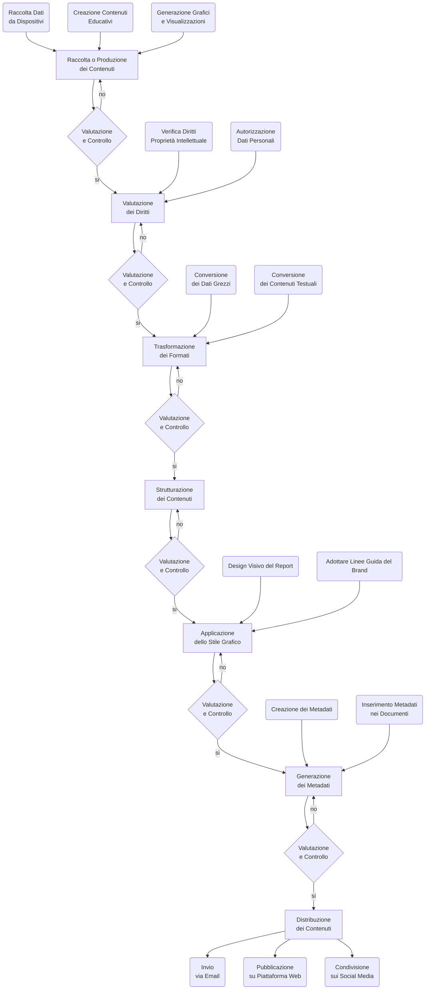

{width=100px height=100px}

# Bioreport

Traccia la Tua Salute, Migliora il Tuo Stile di Vita

## Introduzione

Il progetto Bioreport si propone di offrire un sistema di monitoraggio e analisi dei dati di salute giornalieri, con l’obiettivo di aiutare gli utenti a comprendere meglio il loro stato di benessere fisico. Il sistema raccoglie e visualizza informazioni relative a passi, frequenza cardiaca, frequenza respiratoria, temperatura corporea, livelli di ossigeno nel sangue (SpO2), ore di sonno e qualità del sonno. I dati vengono analizzati per fornire interpretazioni personalizzate, suggerimenti pratici e medie settimanali e mensili per migliorare la salute. Inoltre, ogni settimana, il report completo viene inviato automaticamente in formato PDF via email all'utente, consentendo un facile accesso ai dati e ai suggerimenti.

Il progetto è sviluppato utilizzando tecnologie web moderne, come HTML, CSS e JavaScript. I dati vengono caricati in formato JSON da file esterni e analizzati tramite script JavaScript. Per la visualizzazione dei risultati, sono stati utilizzati grafici dinamici creati con la libreria ECharts, che consente una rappresentazione interattiva dei dati. Inoltre, il progetto include una gestione delle medie settimanali e mensili, con funzionalità di importazione di moduli JavaScript esterni per un’organizzazione ottimale del codice. L'invio del report in formato PDF via email è gestito attraverso un'integrazione con servizi di invio email automatizzato.

Il flusso di gestione documentale in Bioreport è centralizzato nella gestione dei dati di salute provenienti da file JSON esterni, che vengono caricati e analizzati in tempo reale. L’utente può navigare tra le diverse sezioni del report, visualizzando i grafici relativi ai parametri di salute. I dati vengono organizzati in modo tale da generare automaticamente report settimanali e mensili. Ogni settimana, un report completo viene generato, convertito in PDF e inviato via email all'utente. La gestione dei file è semplificata grazie a un sistema di importazione ed esportazione che permette una facile integrazione con altri sistemi di monitoraggio o reportistica.

Il progetto ha raggiunto importanti obiettivi, tra cui la creazione di un sistema intuitivo e interattivo per il monitoraggio della salute quotidiana. Gli utenti possono visualizzare le medie di vari parametri di salute e ricevere suggerimenti personalizzati. I grafici generati dinamicamente offrono una rappresentazione chiara delle tendenze nel tempo, consentendo una comprensione approfondita della propria condizione fisica. Inoltre, l'automazione dell'invio settimanale del report in formato PDF via email fornisce agli utenti una comoda e costante panoramica dei loro progressi. I risultati evidenziano come l’utilizzo di strumenti di analisi avanzata possa migliorare il benessere fisico, portando gli utenti a prendere decisioni più informate riguardo alla propria salute.

## Ideazione

### Tema

Nel contesto dell’industria dei dispositivi smart per il monitoraggio della salute, l’azienda incaricata di sviluppare un prodotto editoriale digitale deve rispondere a una serie di sfide e necessità degli utenti. Il prodotto finale dovrebbe essere una piattaforma interattiva e accessibile che aiuti gli utenti a comprendere i dati raccolti dai dispositivi, come smartwatch o braccialetti fitness, e a migliorare i loro stili di vita attraverso informazioni chiare e utili.

Uno degli aspetti principali del prodotto editoriale sarà l’interpretazione dei dati di salute. I dispositivi smart forniscono una grande quantità di informazioni, tra cui passi giornalieri, frequenza cardiaca, qualità del sonno, livello di ossigeno nel sangue (SpO2), frequenza respiratoria e altri parametri vitali. Tuttavia, molti utenti potrebbero trovarsi in difficoltà nell’interpretare questi numeri e comprendere se sono nella norma o meno. Per questo motivo, il report dovrebbe includere spiegazioni semplici su cosa significano questi dati e suggerimenti pratici su come migliorarli, ad esempio, con aumenti dell’attività fisica, miglioramenti nella qualità del sonno o consigli su come mantenere sotto controllo la salute cardiovascolare.

Inoltre, il prodotto editoriale dovrà affrontare il bisogno di personalizzazione e contestualizzazione dei dati. Ogni utente ha esigenze uniche e il report deve essere in grado di adattarsi a queste differenze. Per esempio, alcuni utenti potrebbero voler monitorare più attentamente i passi giornalieri, mentre altri potrebbero essere più interessati alla qualità del sonno o alla frequenza cardiaca. Fornire obiettivi di salute personalizzati, che possano essere monitorati nel tempo, risulta fondamentale per mantenere alto l’interesse e la motivazione dell’utente. Così, il report dovrà suggerire modalità per fissare e raggiungere obiettivi di salute settimanali o mensili, attraverso un monitoraggio continuo dei progressi.

Un altro tema importante riguarda la motivazione e l'engagement. Gli utenti spesso hanno bisogno di uno stimolo continuo per mantenere un comportamento sano. In tal senso, l'invio di report settimanali via email potrebbe rappresentare una forma di reminder per gli utenti, che potrebbero facilmente dimenticarsi di monitorare regolarmente la loro attività fisica o altri parametri vitali. Un report settimanale è anche un'opportunità per fornire feedback sui progressi raggiunti e incoraggiare l’utente a migliorare ulteriormente.

Parallelamente alla personalizzazione, emerge un altro bisogno importante: la facilità d’uso e la comprensibilità. Molti utenti potrebbero non avere una formazione tecnica per interpretare i dati raccolti dai dispositivi smart. È essenziale che il report sia visivamente chiaro, con grafici semplici da leggere e interpretare. La piattaforma editoriale dovrà essere progettata in modo da rendere facile per l’utente l’accesso e la navigazione, anche da dispositivi mobili, assicurando che ogni informazione sia accessibile in qualsiasi momento.

Un’altra area cruciale riguarda la tecnologia utilizzata per raccogliere i dati. Gli utenti vogliono sapere quanto i loro dispositivi siano precisi e affidabili. Un aspetto importante del prodotto editoriale sarà quindi anche quello di fornire rassicurazioni sull'affidabilità dei dispositivi e su come ottimizzare l’uso degli stessi per ottenere i migliori risultati. Gli utenti vorranno essere certi che i dati raccolti siano accurati e significativi per le loro scelte di salute.

Accanto a questi bisogni, esistono anche tematiche correlate che potrebbero essere di interesse per gli utenti. Per esempio, l’integrazione dei dati da più dispositivi o app potrebbe essere un tema importante, poiché molte persone usano più di un dispositivo per monitorare la loro salute. La possibilità di raccogliere e visualizzare i dati in un'unica piattaforma integrata renderebbe il processo più fluido e pratico. Inoltre, la salute mentale è un tema sempre più rilevante: offrire funzionalità che monitorano anche il benessere psicologico, come la gestione dello stress o l’analisi dei pattern di sonno, potrebbe rendere il report ancora più completo e utile.

Nel complesso, l’obiettivo di questo prodotto editoriale digitale è quello di colmare il gap tra la raccolta dei dati da parte dei dispositivi smart e la loro comprensione e utilizzo da parte degli utenti. La combinazione di analisi chiare, personalizzazione dei suggerimenti e continui stimoli motivazionali, come l’invio dei report settimanali via email, potrebbe essere la chiave per incoraggiare un miglioramento duraturo degli stili di vita degli utenti.

[Ricerca avanzata di Google](https://www.google.com/advanced_search) è stato utilizzata per cercare comunità di riferimento che si occupano del tema
In questo modo possiamo identificare i competitor, il target, le comunità di riferimento e il customer journey.

La creazione di un customer journey map personalizzato è fondamentale per comprendere e ottimizzare l'esperienza dei clienti nel settore della salute digitale. Ecco alcuni passaggi chiave per sviluppare un customer journey efficace:

Identificazione del pubblico target: Comprendere chi sono i tuoi clienti ideali è essenziale. Questo implica analizzare dati demografici, comportamentali e psicografici per creare profili dettagliati dei clienti. 
CUSTOMERMARKETINGALLIANCE.COM
Mappatura del percorso del cliente: Visualizza tutte le fasi che un cliente attraversa, dall'iniziale consapevolezza del problema fino alla ricerca di soluzioni e alla decisione finale. Questo ti aiuterà a identificare i punti di contatto critici e le possibili aree di miglioramento. 
CONTENTSQUARE.COM
Analisi dei punti di contatto: Esamina ogni interazione tra il cliente e il tuo brand, sia online che offline. Valuta l'efficacia di ciascun punto di contatto nel fornire informazioni utili e nel guidare il cliente verso la decisione di acquisto. 
GLASSBOX.COM
Ottimizzazione dell'esperienza digitale: Assicurati che il tuo sito web, le applicazioni mobili e altri canali digitali siano user-friendly, informativi e ottimizzati per dispositivi mobili. Un'esperienza digitale fluida è cruciale nel settore sanitario, dove gli utenti cercano informazioni rapide e affidabili. 
CLEVERTAP.COM
Personalizzazione dei contenuti: Offri contenuti rilevanti e personalizzati che rispondano alle esigenze specifiche dei tuoi clienti. Questo può includere articoli, video, webinar e altri materiali educativi che aiutino i clienti a comprendere meglio i servizi sanitari offerti.
Raccolta e analisi dei feedback: Implementa sistemi per raccogliere feedback dai clienti in ogni fase del loro percorso. Questo ti permetterà di identificare aree di miglioramento e di adattare continuamente la tua strategia alle esigenze in evoluzione dei clienti.
Per approfondire ulteriormente la creazione di customer journey map efficaci, puoi consultare risorse come il guida di Contentsquare e l'articolo di Glassbox.

Incorporando questi elementi, potrai sviluppare un customer journey personalizzato che risponde alle esigenze specifiche dei clienti nel settore della salute digitale, migliorando l'engagement e la soddisfazione complessiva.

### Destinatari
**Persona 1: Luca, l’atleta amatoriale**  
*Età:* 29 anni  
*Professione:* Impiegato nel marketing  
*Stato civile:* Single  
*Tecnologia:* Utilizza regolarmente smartwatch per il monitoraggio delle performance sportive  
*Obiettivi:* Migliorare le sue performance fisiche, monitorare i progressi nel tempo, mantenere una salute ottimale  
*Comportamento digitale:* Si dedica al fitness 3-4 volte a settimana e usa dispositivi per monitorare passi, frequenza cardiaca, sonno e calorie. È un utente abituato a raccogliere e analizzare dati per migliorare il suo allenamento.  
*Bisogni:* Visualizzare dati chiari e comprensibili per monitorare i progressi.
Ricevere suggerimenti personalizzati per migliorare la propria routine sportiva.
Un'interfaccia che mostri i risultati in modo semplice e immediato.  
*Sfide:* Difficoltà nel decifrare grandi quantità di dati senza una guida chiara.
Ha bisogno di migliorare la qualità del sonno e la gestione del recupero.  

**Persona 2: Giulia, la professionista conscia della salute**  
*Età:* 35 anni  
*Professione:* Avvocato  
*Stato civile:* Sposata con un bambino  
*Tecnologia:* Utilizza regolarmente un fitness tracker per monitorare la salute generale e lo stress  
*Obiettivi:* Mantenere un equilibrio tra carriera e vita sana, prevenire problemi di salute a lungo termine, ottimizzare il suo benessere  
*Comportamento digitale:* Giulia è molto attenta al suo benessere. Utilizza il dispositivo per monitorare non solo l’attività fisica ma anche parametri vitali come la frequenza cardiaca e il sonno. È anche una utente molto impegnata che cerca soluzioni rapide e personalizzate.  
*Bisogni:*  
Un report che aiuti a capire come la vita quotidiana impatti sulla sua salute e sul suo stress.  
Dati personalizzati che siano facili da interpretare, soprattutto per i parametri di salute come la qualità del sonno e la frequenza cardiaca.  
Suggerimenti pratici e tempestivi per migliorare la qualità della vita.  
*Sfide:*  
Stress da lavoro e mancanza di tempo per allenarsi.  
Necessità di strategie di gestione del tempo per integrare l’attività fisica nella sua routine quotidiana.  

**Persona 3: Francesco, il genitore attento alla salute**  
*Età:* 45 anni  
*Professione:* Manager  
*Stato civile:* Sposato con due figli  
*Tecnologia:* Utilizza smartwatch per il monitoraggio della salute, soprattutto per tenere traccia dei livelli di stress e sonno  
*Obiettivi:* Mantenere uno stile di vita attivo nonostante gli impegni familiari, monitorare i parametri vitali per prevenire rischi per la salute  
*Comportamento digitale:* Francesco utilizza il dispositivo per monitorare la sua attività fisica giornaliera, il sonno e i livelli di stress. È una persona pratica, non ha molto tempo per complicate analisi, ma si aspetta informazioni utili e concise.  
*Bisogni:*  
Un report settimanale che riassuma i dati raccolti con suggerimenti per migliorare l’attività fisica e ridurre lo stress.  
Una guida per ottimizzare il tempo a disposizione, magari suggerendo allenamenti rapidi o modi per migliorare il sonno.  
*Sfide:*  
Poco tempo a disposizione a causa del lavoro e della famiglia.  
Desiderio di migliorare la qualità della vita, ma spesso trova difficile mantenere il focus sulla propria salute.

**Persona 4: Alessandra, la senior proattiva**  
*Età:* 60 anni  
*Professione:* Pensionata  
*Stato civile:* Vedova, vive da sola  
*Tecnologia:* Ha un dispositivo smart (braccialetto fitness) per monitorare la salute, ma non è molto esperta nella gestione dei dati  
*Obiettivi:* Mantenere la salute e l’indipendenza, prevenire problemi di salute cronici, rimanere attiva  
*Comportamento digitale:* Alessandra utilizza il suo braccialetto fitness per monitorare la frequenza cardiaca, i passi e la qualità del sonno.  
È una persona che cerca di tenersi in forma, ma ha bisogno di maggiore supporto nell’interpretazione dei dati e nelle raccomandazioni pratiche.  
*Bisogni:*  
Un report facile da comprendere, con spiegazioni chiare.  
Suggerimenti pratici per migliorare la mobilità, la postura e la qualità del sonno. Supporto per monitorare i parametri di salute più critici, come la pressione sanguigna o la frequenza cardiaca.  
*Sfide:*  
Non ha familiarità con tecnologie avanzate, quindi ha bisogno di un’interfaccia semplice.  
Desidera vivere una vita lunga e sana ma si sente spesso sopraffatta dalla mole di dati che il dispositivo raccoglie.  

**Persona 5: Pietro, il pensionato attivo**  
*Età:* 75 anni  
*Professione:* Pensionato  
*Stato civile:* Sposato, con figli e nipoti  
*Interessi:* Suona il pianoforte, ama camminare, è un intenditore di vini  
*Abitudini:* Cammina per 1 ora e mezza 4 volte a settimana, suona il pianoforte ogni giorno per un'ora, non si priva mai di un buon bicchiere di vino, ma preferisce una vita più tranquilla rispetto ai suoi anni più giovani.  
*Obiettivi:* Mantenere la propria indipendenza, restare attivo fisicamente e mentalmente, migliorare la qualità della vita anche in età avanzata.  
*Comportamento digitale:* Sebbene Pietro non sia molto abituato alla tecnologia, utilizza un dispositivo di monitoraggio per tenere traccia dei suoi parametri vitali. Ha bisogno di un'interfaccia semplice e intuitiva che lo aiuti a comprendere il suo stato di salute senza sentirsi sopraffatto dai dati.  
*Bisogni:*  
Un report che evidenzi chiaramente i parametri vitali, con un focus sulla frequenza cardiaca e il sonno.  
Un modo semplice per monitorare la sua attività fisica e ricevere suggerimenti su come migliorare la sua routine di camminata e altre attività.  
Un’interfaccia non troppo complessa che spieghi in modo chiaro il significato dei dati.  
*Sfide:*  
Difficoltà nell’utilizzo di nuove tecnologie. Ha bisogno di un approccio pratico e diretto che non richieda troppa interazione con il dispositivo.  
Desidera continuare a godere delle sue passioni, come suonare il pianoforte e camminare, ma vuole monitorare la sua salute per prevenire eventuali problematiche.  

**Persona 6: Stefano, il lavoratore pratico**  
*Età:* 51 anni  
*Professione:* Ascensorista  
*Stato civile:* Sposato con figli  
*Interessi:* Segue tutti gli sport in televisione, ama andare in bicicletta  
*Abitudini:* Non ha un programma fisso di allenamento, ma cerca di ritagliarsi tempo per andare in bicicletta nei weekend e seguire le partite di calcio.  
*Obiettivi:* Rimanere attivo, mantenere un buono stato di salute nonostante gli impegni quotidiani, sfruttare al meglio il tempo limitato a disposizione.  
*Comportamento digitale:* Stefano utilizza uno smartwatch per monitorare la sua attività fisica, ma non è un utente esperto. Si aspetta un prodotto che possa fornirgli dati chiari e concreti senza richiedere troppo tempo per interpretare i risultati.  
*Bisogni:*  
Un report che sintetizzi i dati in modo semplice e comprensibile, magari con un focus sulle calorie bruciate, i passi e la frequenza cardiaca.  
Suggerimenti pratici che lo aiutino a ottimizzare la sua attività fisica nonostante la mancanza di tempo, come allenamenti rapidi o routine di bicicletta.  
Un sistema che gli permetta di visualizzare facilmente se sta migliorando o se è necessario fare dei cambiamenti nel suo stile di vita.  
*Sfide:*  
Tempo limitato per allenarsi, quindi ha bisogno di un programma di monitoraggio che si adatti alla sua vita frenetica.  
Ha bisogno di dati pratici che gli permettano di migliorare la sua salute senza troppa complessità.  

**Persona 7: Lorena, la studentessa dinamica**  
*Età:* 20 anni  
*Professione:* Studentessa  
*Stato civile:* Vive con i genitori e i fratelli  
Interessi: Nuoto, socializzare, viaggiare  
Limiti: Ha poco tempo da dedicare allo sport a causa degli impegni universitari  
*Abitudini:* Fa la pendolare per seguire l'università, ha una vita molto attiva ma ricca di impegni, con pochissimi spazi per fare attività fisica regolare.  
*Obiettivi:* Mantenere un buon livello di salute e forma fisica, anche se la vita universitaria è molto impegnativa. Vorrebbe migliorare la qualità del sonno e gestire lo stress.  
*Comportamento digitale:* Lorena è molto tecnologica e usa il suo smartphone per monitorare la salute. Le piace ricevere aggiornamenti regolari sui suoi progressi, ma cerca un’esperienza rapida e coinvolgente, che si integri facilmente nella sua routine frenetica.  
*Bisogni:*  
Un report che faccia un’analisi delle sue abitudini quotidiane e che le dia consigli pratici su come migliorare la sua salute, in particolare sulla qualità del sonno e sulla gestione dello stress.  
Dati che possano motivarla a trovare il tempo per allenarsi e migliorare le sue prestazioni nel nuoto.  
Un'interfaccia che si adatti alla sua vita frenetica e che la supporti nel miglioramento continuo.  
*Sfide:*  
Ha poco tempo libero a causa dello studio e della vita universitaria.  
Cerca soluzioni rapide e concrete per migliorare la sua salute senza aggiungere troppi impegni.  

### Modello di fruizione

**Requisiti di Accettazione**  
Il prodotto deve essere facilmente accessibile su tutti i dispositivi, inclusi desktop, tablet e smartphone, per consentire una fruizione ovunque e in qualsiasi momento. L'interfaccia deve essere semplice, con un design chiaro e facilmente comprensibile. La navigazione deve essere intuitiva, senza barriere tecnologiche, per soddisfare anche chi ha una bassa familiarità con la tecnologia (ad esempio, le Personas come Pietro). I report devono essere personalizzati in base ai dati raccolti dal dispositivo e alle abitudini individuali degli utenti. Ogni persona deve poter ricevere contenuti che rispondano alle sue necessità specifiche, come monitoraggio dell’attività fisica, qualità del sonno, frequenza cardiaca, ecc. I destinatari devono poter interagire con i dati. L'interazione può includere la visualizzazione di grafici interattivi, suggerimenti per migliorare la salute o semplici call to action per incentivare comportamenti più sani (come camminare di più, dormire meglio, ecc.). I report settimanali o mensili devono essere chiari, concisi e facili da interpretare. Devono includere suggerimenti pratici, grafici e spiegazioni visive, con un linguaggio semplice. Il prodotto deve rispettare le normative sulla protezione dei dati personali (ad esempio, GDPR) e garantire che tutte le informazioni personali raccolte siano trattate in modo sicuro e confidenziale.

**Modelli di Lettura e di Fruizione Efficaci**
La modalità di lettura e fruizione deve adattarsi al comportamento e alle preferenze degli utenti. Il nostro prodotto dovrà includere i seguenti elementi:  
- Report Visivi: L’uso di grafici interattivi e diagrammi a barre o a torta è fondamentale per rendere i dati facilmente comprensibili, soprattutto per gli utenti più anziani come Pietro, che potrebbero non essere abituati a leggere report di testo complessi. La visualizzazione deve evidenziare tendenze e anomalie in modo chiaro.
- Contenuti Sintetici: I report non devono essere troppo lunghi o dettagliati. Per le persone con poco tempo, come Stefano e Lorena, contenuti concisi con riassunti visivi dei dati più importanti sono più efficaci.
- Micro-Interazioni: Piccole interazioni, come la possibilità di cliccare su un grafico per esplorare più dettagli o ricevere suggerimenti personalizzati, possono migliorare l’engagement e rendere l’esperienza più interattiva e coinvolgente.
- Audio e Video Supportivi: Per i meno esperti di tecnologia o per coloro che hanno bisogno di un supporto extra, includere video tutorial o audio esplicativi potrebbe essere una buona soluzione. Ad esempio, un breve video che spiega come interpretare i grafici o come migliorare la qualità del sonno.
- Push Notifications e Email: Invio settimanale di report via email in formato PDF o tramite notifiche push, con un link per accedere direttamente ai dettagli dell’analisi. Questo permette agli utenti di ricevere un aggiornamento regolare senza doversi ricordare di verificare manualmente i loro dati.

**Standard di Riferimento**
Gli standard di riferimento devono assicurare che il prodotto rispetti le migliori pratiche di sviluppo, fruizione e qualità. Alcuni degli standard da considerare includono:
- Standard di Accessibilità Web (WCAG): Assicurarsi che il sito e le applicazioni siano conformi agli standard di accessibilità web WCAG (Web Content Accessibility Guidelines), per garantire che persone con disabilità possano usufruire del prodotto.
- Normative sulla Privacy e Sicurezza (GDPR): Essere pienamente conformi alla legge GDPR (General Data Protection Regulation) per garantire che i dati sensibili raccolti dagli utenti siano trattati in modo sicuro.
- Standard di Usabilità (ISO 9241): Implementare i principi di usabilità definiti nella ISO 9241 per migliorare l'esperienza utente, rendendo il prodotto facile da usare e interattivo.
- Compatibilità con le Piattaforme e Dispositivi: Il prodotto dovrebbe seguire gli standard di compatibilità cross-platform, assicurandosi che funzioni senza problemi su dispositivi mobili, desktop, e tablet. Inoltre, l’integrazione con i dispositivi di monitoraggio della salute (smartwatch, braccialetti fitness) deve essere impeccabile.

**Innovazioni Proposte**
Innovazioni nella qualità dei contenuti:

*Analisi Predittiva e Personalizzata:* Integrare algoritmi di intelligenza artificiale per analizzare i dati storici degli utenti e fare previsioni personalizzate. Ad esempio, basandosi sui dati di attività fisica, il sistema potrebbe suggerire modifiche al programma settimanale di allenamento.
*Suggerimenti Interattivi Personalizzati:* Fornire suggerimenti personalizzati basati sui dati raccolti. Ad esempio, se l'utente non ha raggiunto il numero di passi settimanali, il sistema potrebbe suggerire attività specifiche come camminare al parco o fare una breve passeggiata durante la pausa pranzo.
*Integrazione con altri dispositivi IoT:* Il prodotto potrebbe evolversi integrandosi con altri dispositivi IoT, come termostati intelligenti, luci o sistemi di domotica, per suggerire modifiche ambientali che favoriscano il benessere fisico e mentale dell'utente (ad esempio, regolazione della temperatura per migliorare il sonno).  

### Canali di distribuzione

Per raggiungere il maggior numero di utenti e ottimizzare la fruizione del prodotto editoriale digitale, è fondamentale individuare i canali di distribuzione più appropriati e i formati dati richiesti da ciascuno di essi. Di seguito, vengono esplorati i canali principali e i formati dati più adatti:

**Web**
Canale: Il sito web ufficiale o la piattaforma di report online, accessibile tramite browser da qualsiasi dispositivo (desktop o mobile).
Formato: WebBook o PDF interattivo. Un WebBook è ideale per la visualizzazione online, permettendo una lettura fluida e interattiva. In alternativa, il formato PDF sarà utilizzato per i report personalizzati, che possono essere visualizzati e scaricati facilmente.
Caratteristiche: Il contenuto sarà progettato per essere visualizzato in modo responsivo, adattandosi automaticamente a diverse dimensioni di schermo. I report dovranno essere facilmente scaricabili in formato PDF, per consentire agli utenti di archiviare o stampare i propri report.

**Social Media**
Canale: Piattaforme social come Instagram, Facebook, Twitter e LinkedIn per la promozione dei report, suggerimenti e notizie relative al monitoraggio della salute e al benessere.
Formato: Immagini, video brevi, grafici infografici. I contenuti social devono essere veloci e facili da consumare, con focus sulle informazioni visive (come grafici e tabelle semplificate). I video brevi possono includere tutorial o highlights dei report mensili/settimanali.
Caratteristiche: Questi contenuti devono essere facilmente condivisibili, coinvolgenti e visivamente accattivanti. Devono essere accompagnati da call-to-action per indirizzare gli utenti al sito web per l'accesso completo al report personalizzato.

**Marketplace**
Canale: Piattaforme come Google Play o App Store, dove l'applicazione mobile del prodotto può essere distribuita.
Formato: App Mobile con file di report in PDF scaricabili. Gli utenti possono scaricare l’app e ricevere i report direttamente sul loro smartphone. I file di report possono essere visualizzati direttamente nell’app e scaricati in PDF.
Caratteristiche: L'app mobile deve essere progettata per una fruizione semplice e immediata, con la possibilità di accedere ai report settimanali/mensili e altre funzionalità di monitoraggio. Gli utenti potranno anche ricevere notifiche push per essere informati sugli aggiornamenti del report.

---
*Tendenze Stilistiche*
Si raccomandano toni freschi e rassicuranti come verde, blu e bianco, che trasmettono un senso di tranquillità e benessere, ma anche energia e vitalità. Il verde è spesso associato alla salute, il blu alla fiducia, e il bianco alla chiarezza.
Le icone devono essere chiare e facilmente riconoscibili. Per esempio, l’icona del cuore per la frequenza cardiaca, il simbolo del sonno per la qualità del sonno, ecc. Un uso moderato delle icone aiuterà a rendere il report più visivamente interessante e intuitivo.
l logo dovrebbe essere semplice e facilmente riconoscibile, riflettendo un senso di innovazione tecnologica senza risultare troppo complesso o futuristico.

Si consiglia l’uso di font sans-serif per la leggibilità, come Roboto o Open Sans, che sono facili da leggere anche su schermi di dimensioni ridotte. L’uso di titoli chiari e sottotitoli aiuterà a segmentare le informazioni in modo chiaro.
Gerarchia tipografica: Utilizzo di dimensioni del testo in modo consistente per garantire la chiarezza. I titoli dovrebbero essere ben visibili (es. 24px), i sottotitoli un po’ più piccoli (es. 18px), e il corpo del testo dovrebbe essere in una dimensione comoda per la lettura (es. 16px).

Per migliorare l’esperienza utente, si consiglia uno stile minimalista. Evitare sovraccarichi di informazioni e garantire che ogni elemento visivo e tipografico abbia uno scopo preciso, per non distrarre l’utente.
Grafici e visualizzazioni interattive: L’interattività sarà fondamentale nel report. I grafici dovranno permettere all’utente di interagire con i dati (zoom, selezione, comparazione) per personalizzare l’esperienza e migliorare la comprensione.

Spesso si utilizzano PDF o ePub per la distribuzione di report medici digitali, con formati facilmente leggibili e stampabili. I PDF sono generalmente utilizzati per la loro capacità di mantenere il formato e la qualità del contenuto su qualsiasi dispositivo.
Alcuni dispositivi di monitoraggio utilizzano Word o WebBook per i report interattivi di fitness, che si adattano bene alle piattaforme di gestione dei dati personali.

Nel contesto del prodotto editoriale digitale, è importante trovare un equilibrio tra innovazione e aderenza a modelli conosciuti.
Proporre interattività e personalizzazione dei report, attraverso visualizzazioni grafiche avanzate e l’analisi dei dati in tempo reale, rappresenta un elemento di innovazione. È essenziale anche adottare alcuni modelli conosciuti come il formato PDF, che è ampiamente utilizzato e facilmente condivisibile, per garantire che anche gli utenti meno tecnologici possano fruire facilmente dei report. Le funzionalità devono essere intuitive, senza necessità di un lungo periodo di apprendimento.

Il tono del prodotto editoriale sarà informale ma professionale. Questo equilibrio è pensato per risultare accogliente e motivante per gli utenti, senza compromettere l’affidabilità e la serietà delle informazioni fornite. L’approccio formale è importante per la credibilità dei contenuti, ma l’approccio informale renderà l’esperienza dell'utente più piacevole e accessibile, mantenendo la relazione amichevole e incoraggiante che invoglia gli utenti a migliorare il loro stile di vita e a mantenere alta la loro motivazione.

## Processo di Produzione

### Acquisizione dei contenuti

Per lo sviluppo di questo prodotto digitale saranno considerate le seguenti fonti per l'acquisizione dei contenuti:  

**Fonti Libere**
Queste fonti sono disponibili gratuitamente e possono essere facilmente accessibili, spesso senza necessità di licenze o costi aggiuntivi. Queste fonti sono particolarmente utili per raccogliere informazioni generali, statistiche e dati di base.

*Dati Pubblici e Open Data:* Le fonti governative e gli archivi pubblici forniranno dati aggregati e di tendenze su salute e benessere. Esempi includono i report annuali sulla salute pubblica, i dati epidemiologici e le linee guida sulla salute raccomandate da enti pubblici come l'OMS (Organizzazione Mondiale della Sanità) o i Centri per il Controllo e la Prevenzione delle Malattie (CDC).
*Fonti Accademiche e Pubblicazioni Scientifiche Open Access:* Articoli e paper accademici pubblicati in open access forniranno dati scientifici e articoli di ricerca che alimentano l'accuratezza dei contenuti relativi alla salute, come l’effetto dell'attività fisica sulla salute cardiovascolare, la qualità del sonno, ecc.
*Dati Meteo Pubblici:* Le condizioni climatiche o ambientali (come temperatura e umidità) possono essere rilevanti per analizzare il benessere fisico. Fonti come il National Weather Service (NWS) o OpenWeatherMap forniranno dati climatici liberi da licenza.
*Fonti di Benessere e Salute:* Per suggerimenti generali su abitudini salutari e stili di vita, si possono usare siti web di salute accreditati, blog di esperti del settore e guide pratiche gratuite disponibili in rete.
Costo di acquisizione: Basso o nullo. Queste fonti sono generalmente gratuite e facilmente accessibili.

**Fonti Generabili Automaticamente**
Queste fonti derivano dall'automazione e dalla raccolta diretta dei dati tramite strumenti digitali. Sono particolarmente utili per raccogliere dati specifici e personalizzati degli utenti, che sono essenziali per la creazione di report individuali.

*Dati dei Dispositivi di Monitoraggio (Smartwatch e Braccialetti Fitness):* I dispositivi smart per il monitoraggio della salute generano automaticamente dati relativi a frequenza cardiaca, attività fisica, spO2, temperatura corporea, ore di sonno, ecc. Questi dati vengono raccolti tramite sensori e trasmessi automaticamente alla piattaforma digitale o app.
*Dati dell’App Mobile o Piattaforma Web:* La piattaforma di report interattivo raccoglie automaticamente le informazioni tramite l'interazione degli utenti, come impostazioni di attività, preferenze di allenamento, storico delle performance, ecc. Questi dati possono essere utilizzati per calcolare le medie settimanali, mensili e annuali, personalizzando il report per ogni utente.
*Monitoraggio del Sonno e della Qualità del Sonno:* Molti dispositivi di monitoraggio offrono dati automatici sulla qualità del sonno, generando report su quanto e come una persona dorme, inclusi indicatori come il numero di risvegli e la durata del sonno profondo.

Costo di acquisizione: Basso. Una volta implementato il sistema di raccolta automatica, i costi sono limitati alla gestione dei dati e all'infrastruttura tecnologica.

**Fonti che Richiedono un Lavoro di Redazione Manuale**
Alcuni contenuti richiedono un lavoro di redazione manuale per fornire spiegazioni, interpretazioni e consigli basati sui dati raccolti. Questi contenuti devono essere curati da esperti e redattori per garantire l'accuratezza e l'affidabilità.

*Interpretazioni dei Dati:* L'analisi dei dati raccolti, come la frequenza cardiaca, i passi giornalieri, la qualità del sonno, ecc., richiede un lavoro manuale di interpretazione. Gli esperti devono fornire spiegazioni contestualizzate, come l'interpretazione della salute cardiovascolare in base ai dati dell'attività fisica, o l'influenza delle abitudini di sonno sui livelli di energia.
*Suggerimenti Personalizzati:* Basandosi sui dati raccolti, i consigli personalizzati riguardanti la dieta, l'attività fisica o lo stile di vita devono essere redatti da esperti in nutrizione, fitness e salute mentale. Questi suggerimenti devono essere pratici e facilmente applicabili dagli utenti, tenendo conto delle loro abitudini e necessità specifiche.
*Contenuti Educativi e Guide:* È fondamentale includere contenuti educativi redatti manualmente per educare gli utenti su come leggere i dati e trarne beneficio. Questi potrebbero includere articoli su come migliorare la qualità del sonno, benefici dell'attività fisica per la salute cardiovascolare, importanza della gestione dello stress, ecc.
*Aggiornamenti Periodici e Report Analitici:* Ogni settimana o mese, sarà necessario aggiornare i report con nuovi dati e analisi. L'elaborazione di questi contenuti richiederà un intervento umano per personalizzare i risultati in base ai cambiamenti nel comportamento dell'utente.

Costo di acquisizione: Moderato. Richiede l'intervento di esperti (medici, nutrizionisti, personal trainer) e redattori, con l'eventuale necessità di mantenere un team dedicato alla creazione di contenuti freschi e aggiornati.

### Gestione documentale

Il flusso di gestione documentale per il progetto editoriale "Bioreport", che mira a generare report personalizzati e interattivi sui dati di salute raccolti dai dispositivi smart, è composto da una serie di fasi sequenziali che garantiscono la qualità, la coerenza e l'affidabilità dei contenuti. Ogni fase prevede delle revisioni e controlli per assicurare che il prodotto finale risponda agli standard richiesti.

1. Raccolta o Produzione dei Contenuti

La fase di raccolta o produzione dei contenuti è la base del progetto e include la raccolta dei dati grezzi e la creazione dei contenuti necessari per i report. I dati provenienti dai dispositivi smart (come smartwatch e braccialetti fitness) vengono raccolti automaticamente attraverso le API dei dispositivi o tramite app dedicate.
Vengono prodotti contenuti educativi (articoli o suggerimenti personalizzati), basati sui dati raccolti, per migliorare la salute dell'utente.
I dati raccolti vengono trasformati in visualizzazioni grafiche che saranno poi inserite nel report.
I contenuti vengono revisionati e controllati per verificare che i dati siano corretti e completi e i contenuti generati senza errori e incoerenze. Fondamentale è la convalida dei dati da parte di esperti (medici, nutrizionisti, ecc.) per garantire l’affidabilità.

2. Valutazione dei Diritti

In questa fase, vengono valutati i diritti relativi ai dati raccolti, al contenuto generato e alle fonti utilizzate. È importante che tutte le risorse utilizzate siano legalmente autorizzate per l'uso nel prodotto editoriale, rispettando le normative sulla privacy e i diritti d’autore.
Si effettua un controllo sui diritti d'uso delle fonti esterne, come articoli scientifici o dati pubblici e si verifica che i dati raccolti tramite dispositivi smart siano trattati nel rispetto delle normative GDPR (Regolamento Generale sulla Protezione dei Dati).

3. Trasformazione dei Formati 

I contenuti raccolti e prodotti devono essere trasformati in formati compatibili con i canali di distribuzione previsti. Questo passaggio è cruciale per garantire che i contenuti siano fruibili su diverse piattaforme e dispositivi.
I dati grezzi vengono convertiti in formati utilizzabili per grafici, tabelle e altri strumenti visuali (es. JSON, ecc.).
I report in formato testo (ad esempio Word o HTML) vengono convertiti in PDF, ePub, o altri formati compatibili con i canali di distribuzione.
Si testa la compatibilità per ogni formato di uscita, assicurandosi che il contenuto sia visualizzabile correttamente su tutti i dispositivi e canali e si verifica la leggibilità e la chiarezza del contenuto nelle diverse versioni.

4. Strutturazione dei Contenuti

Una volta trasformati nei formati desiderati, i contenuti devono essere strutturati in modo logico e coerente, in modo che gli utenti possano navigare facilmente all'interno dei report.
Si definisce la struttura del documento (introduzione, analisi dei dati, suggerimenti personalizzati, conclusioni), implementando link, pulsanti o interazioni che permettano all'utente di esplorare i report in modo dinamico.
Si controlla che venga mantenuta la coerenza tra la struttura proposta e gli obiettivi del report (chiaro, conciso, informativo).

5. Applicazione dello Stile Grafico (v)

Lo stile grafico è fondamentale per l'esperienza visiva e l'usabilità del report. La grafica deve essere coerente con il brand e deve facilitare la comprensione dei dati e delle informazioni.
Creazione di un layout coerente e professionale, utilizzando colori, tipografia, immagini e grafici che migliorino l'esperienza utente.
Implementazione di un sistema grafico che rispetti le linee guida del brand per garantire coerenza tra i vari report.
Verifica estetica e funzionale del design.
Assicurazione che il design non ostacoli la leggibilità e la fruibilità del contenuto.

6. Generazione dei Metadati

I metadati sono fondamentali per il corretto indicizzamento e per il miglioramento della ricerca, sia per i motori di ricerca interni che per quelli esterni. Ogni report deve essere arricchito con metadati pertinenti.
Aggiunta di metadati come titolo, autore, descrizione, parole chiave, data di creazione e versione del report.
I metadati vengono inseriti nei formati dei documenti generati (PDF, ePub, ecc.).
Verifica della completezza e accuratezza dei metadati.
Assicurazione che i metadati siano correttamente formattati per l'uso su piattaforme di distribuzione.  

7. Distribuzione dei Contenuti

Una volta completato il report, il contenuto finale deve essere distribuito attraverso i canali predefiniti. La distribuzione deve essere tempestiva e conforme alle preferenze degli utenti.
Invio via Email: I report personalizzati vengono inviati via email settimanalmente agli utenti.
Pubblicazione su Piattaforma Web: I report anche resi disponibili online, attraverso un'area riservata su un sito web o tramite app mobile.
Condivisione sui Social Media: Per promuovere il progetto, estratti del report possono essere condivisi sui social network aziendali.
Verifica che i report siano distribuiti correttamente via email e che i link web funzionino.
Assicurazione che l'utente riceva una notifica di ricezione.

### Tecnologie adottate
| **Fase del Flusso di Gestione Documentale**        | **Tecnologie Adottate**                                                                                 | **Contributo agli Obiettivi**                                                                                                                                                                |
|-----------------------------------------------------|----------------------------------------------------------------------------------------------------------|--------------------------------------------------------------------------------------------------------------------------------------------------------------------------------------------|
| Raccolta o Produzione dei Contenuti                | API di raccolta dati (es. API per smartwatch e braccialetti fitness), Piattaforme di generazione contenuti.              | Consente di ottenere dati in tempo reale dai dispositivi, fornendo contenuti personalizzati basati sul comportamento e attività degli utenti.        |
| Valutazione dei Diritti                            | Software di gestione diritti (es. DRM)                              | Garantisce che i dati siano gestiti in modo conforme alle normative sulla privacy (es. GDPR) e alle leggi sui diritti di proprietà intellettuale.                    |
| Trasformazione dei Formati                         | Strumenti di conversione automatica (es. Pandoc, Adobe Acrobat), Librerie di programmazione per conversione di formati (JavaScript)                            | Permette di creare contenuti in formati compatibili con vari dispositivi e piattaforme, garantendo l’accessibilità ai report su diversi dispositivi e canali. |
| Strutturazione dei Contenuti                       | CMS (Content Management System), Framework di sviluppo web (React), Strumenti di editing grafico (Adobe Illustrator)                                 | Assicura che i contenuti siano ben organizzati e facilmente fruibili, migliorando la navigabilità e la fruizione da parte degli utenti.                  |
| Applicazione dello Stile Grafico                   | CSS,  Strumenti di design grafico (Adobe XD, Sketch)                                      | Garantisce un design coerente e personalizzato che rinforza l’identità visiva del brand, migliorando l’esperienza utente visiva e il riconoscimento del marchio. |
| Generazione dei Metadati                           | Strumenti di automazione dei metadati, Software di analisi dei dati      | Permette di migliorare la scoperta e la ricerca dei contenuti attraverso l’uso di metadati efficaci, migliorando l’usabilità e l'accessibilità del report. |
| Distribuzione dei Contenuti                        | Email Marketing Software, CMS (WordPress), API di condivisione social (Facebook, Twitter), Cloud Services (AWS, Google Cloud) | Consente di distribuire i report a un pubblico ampio e diversificato, garantendo l'accesso tramite email, web o social media, in modo puntuale e scalabile.         |

### Esecuzione del flusso

[LINK alla repository] (https://github.com/PatriziaLeggio/EditoriaDigitaleProject.git)

## Valutazione dei risultati raggiunti

### Valutazione del flusso di produzione

*Riduzione dei tempi di gestione documentale:* Le fasi più automatizzate (raccolta, valutazione diritti, trasformazione formati, generazione metadati, distribuzione) contribuiscono in modo significativo alla riduzione dei tempi complessivi, poiché minimizzano la necessità di intervento manuale e velocizzano la produzione del contenuto.
*Riduzione degli errori:* Le fasi che prevedono l'automazione (ad esempio, la valutazione dei diritti, la trasformazione dei formati, la generazione di metadati) riducono il rischio di errori, in particolare nei processi ripetitivi e complessi.
*Miglioramento della qualità dei documenti:* La strutturazione dei contenuti e l'applicazione dello stile grafico contribuiscono notevolmente al miglioramento della qualità estetica e informativa del prodotto finale. L'adozione di formati standardizzati e metadati corretti migliora la qualità complessiva dei documenti.
*Miglioramento del livello di accettazione della tecnologia:* Le fasi che riguardano l'applicazione di un design intuitivo (ad esempio, la strutturazione dei contenuti e la grafica) e l'uso di formati conosciuti migliorano l'esperienza dell'utente e, quindi, l'accettazione della tecnologia.
*Raggiungimento di nuovi canali di distribuzione:* La trasformazione dei formati e la generazione dei metadati rendono i contenuti facilmente distribuibili su diversi canali, come social media, email, e piattaforme web.
*Soddisfacimento di nuovi scenari d'uso:* Il processo di gestione documentale offre flessibilità per rispondere a scenari d'uso diversi, dal monitoraggio della salute ai report personalizzati, garantendo che i contenuti siano adattabili e fruibili in modalità differenti.

Di seguito una tabella di valutazione che evidenzia come ciascuna fase del flusso di gestione documentale contribuisca a ciascuno criterio.

| **Fase del flusso** | **Riduzione dei tempi di gestione documentale** | **Riduzione degli errori** | **Miglioramento della qualità dei documenti** | **Miglioramento del livello di accettazione della tecnologia** | **Raggiungimento di nuovi canali di distribuzione**| **Soddisfacimento di nuovi scenari d'uso** |
|---|---|---|---|---|---|---|
| **1. Raccolta o Produzione Contenuti** | Alta | Media | Media | Alta | Alta | Alta |
| **2. Valutazione dei Diritti** | Media | Alta | Alta | Alta | Media | Alta |
| **3. Trasformazione dei Formati**  | Alta | Media| Alta| Alta | Alta | Alta |
| **4. Strutturazione dei Contenuti** | Media| Alta| Alta| Alta | Alta| Alta|
| **5. Applicazione dello Stile Grafico** | Media | Alta| Alta| Alta | Alta| Alta|
| **6. Generazione dei Metadati**    | Alta | Alta | Alta| Media| Media| Alta |
| **7. Distribuzione dei Contenuti** | Alta | Media | Alta | Alta| Alta | Alta |

### Confronto con lo stato dell'arte

| **Fase del flusso**                 | **AS-IS (Stato Attuale)**                                                      | **TO-BE (Stato Futuro con Innovazioni)**                                      |
|-------------------------------------|--------------------------------------------------------------------------------|-------------------------------------------------------------------------------|
| **1. Raccolta o Produzione Contenuti** | Manuale, raccolta dei dati tramite fonti disomogenee e con possibili errori. I dati devono essere raccolti manualmente e inseriti in un sistema. | **Automazione**: La raccolta automatica dei dati tramite API e dispositivi smart velocizza e standardizza il processo, riducendo gli errori e aumentando la velocità.  |
| **2. Valutazione dei Diritti**      | I diritti vengono verificati manualmente, aumentando i tempi di gestione e il rischio di errori. | **Automazione**: Software per il controllo dei diritti automatizza la verifica, riducendo i tempi e gli errori. Garanzia che i contenuti siano conformi alla legge. |
| **3. Trasformazione dei Formati**   | I formati vengono convertiti manualmente tramite software di terze parti, con il rischio di errori nel processo. | **Automazione**: Conversione automatica dei formati tramite tool specifici (e.g., PDF) garantendo uniformità e rapidità. |
| **4. Strutturazione dei Contenuti** | La struttura del documento è spesso disorganizzata, con formattazioni incoerenti che richiedono molta manualità. | **Automazione**: Creazione di strutture di documenti in maniera automatizzata, migliorando la leggibilità e la qualità complessiva del documento. L'uso di template migliora la coerenza. |
| **5. Applicazione dello Stile Grafico** | La grafica è applicata manualmente, con un rischio maggiore di errori visivi e di design incoerente. | **Automazione + Standardizzazione**: Applicazione di uno stile grafico uniforme con l’uso di template e design predefiniti, migliorando la qualità estetica e riducendo gli errori. |
| **6. Generazione dei Metadati**     | I metadati sono generati manualmente, con possibilità di omissioni o errori. | **Automazione**: Generazione automatica di metadati (es. titolo, autore, data), migliorando l’indicizzazione e la ricerca dei contenuti. |
| **7. Distribuzione dei Contenuti**  | Distribuzione tramite canali tradizionali, come invio manuale via email o upload su piattaforme. | **Multicanale + Automazione**: I contenuti vengono distribuiti automaticamente su più canali (social media, email, piattaforme online) con accessibilità su dispositivi mobili e desktop. |

L'adozione della tecnologia e delle innovazioni proposte nel flusso di gestione documentale non solo velocizza e ottimizza i processi, ma riduce anche il rischio di errori, migliora la qualità complessiva dei documenti, e consente una fruizione più fluida e accessibile. In particolare, l'automazione e l'uso di sistemi digitali avanzati sono cruciali per rispondere efficacemente alle esigenze di velocità, qualità, e accessibilità.

In sintesi, il flusso AS-IS presenta un sistema che richiede ampie risorse manuali e presenta rischi legati agli errori e ai tempi di gestione, mentre il flusso TO-BE, con l'introduzione delle tecnologie proposte, consente un miglioramento sostanziale in termini di efficienza, qualità, e capacità di distribuzione su nuovi canali.

### Limiti emersi

1. Impossibilità di accesso ad alcune tecnologie
Tecnologia non disponibile per tutti gli utenti: Alcuni utenti potrebbero non avere accesso a dispositivi o tecnologie moderne necessarie per sfruttare il flusso automatizzato. Questo potrebbe includere l'accesso a dispositivi smart per il monitoraggio della salute, che potrebbe non essere compatibile con le necessità di alcune demografie (ad esempio, utenti anziani o in zone con connessioni Internet limitate).
Mancanza di compatibilità con alcuni formati e sistemi: La tecnologia proposta potrebbe non integrarsi facilmente con i sistemi esistenti in azienda o con dispositivi legacy non in grado di supportare le funzionalità richieste (ad esempio, la raccolta automatica dei dati da dispositivi indossabili).
2. Limiti nell’automazione di alcuni passi del flusso
Automazione della trasformazione dei formati: La trasformazione automatica dei formati potrebbe non essere perfetta per tutti i tipi di contenuti o formati di file, in particolare quando si tratta di documenti complessi con grafica o contenuti multimediali. Alcuni formati potrebbero richiedere una revisione manuale per mantenere la qualità del documento finale.
Verifica dei diritti e licenze: L’automazione del controllo dei diritti potrebbe incontrare difficoltà in scenari complessi dove i diritti d'autore sono frammentati o non facilmente tracciabili attraverso gli strumenti disponibili. Questo potrebbe portare a un errore nell'automazione del flusso.
3. Limiti nell'integrazione delle sorgenti
Dati provenienti da fonti disomogenee: L'integrazione di dati da diverse fonti, come dispositivi indossabili, database esterni o input manuali, potrebbe non essere completamente automatizzata in modo da garantire un flusso uniforme e preciso. Ogni fonte potrebbe avere formati e standard diversi, complicando l'automazione del processo di raccolta e standardizzazione.
Problemi di sincronizzazione dei dati: La sincronizzazione e l'allineamento dei dati provenienti da diverse sorgenti potrebbero risultare difficili, specialmente quando si gestiscono dispositivi o sistemi non completamente compatibili con il flusso automatizzato.
4. Mancanza di competenze o familiarità con la tecnologia
Resistenza al cambiamento: Alcuni utenti potrebbero non essere familiari con il processo tecnologico automatizzato e potrebbero avere difficoltà nell'adattarsi a nuove piattaforme o strumenti. Per esempio, un utente anziano potrebbe non essere abituato a utilizzare dispositivi smart o strumenti digitali per la raccolta dei dati sulla salute.
Accesso limitato a formazione o supporto: Se non sono disponibili risorse educative adeguate o assistenza tecnica, gli utenti potrebbero non essere in grado di sfruttare appieno le funzionalità proposte dal prodotto digitale.
5. Problemi di scalabilità
Gestione di grandi volumi di dati: Man mano che il numero di utenti cresce, potrebbe essere difficile gestire una grande quantità di dati raccolti e trasformati, soprattutto se il flusso automatizzato non è progettato per essere scalabile. La gestione di un volume crescente di dati potrebbe comportare rallentamenti o problemi di performance nelle fasi di elaborazione e distribuzione.
6. Rischi legati alla sicurezza e alla privacy
Sicurezza dei dati: Quando si raccolgono dati sensibili come le informazioni sanitarie o comportamentali, la protezione dei dati diventa una priorità assoluta. La gestione automatizzata del flusso documentale potrebbe presentare vulnerabilità, se non implementata con adeguati protocolli di sicurezza, aumentando i rischi legati alla privacy e alla protezione dei dati personali.
Conformità legale: Anche se il sistema automatizza il controllo dei diritti, non è detto che tutte le regolamentazioni locali o internazionali siano facilmente integrabili nel processo automatizzato, creando un ulteriore ostacolo al flusso.

Questi limiti rappresentano degli ostacoli che potrebbero compromettere l'efficienza e l'efficacia del flusso di gestione documentale. La chiave per superarli risiede in un continuo perfezionamento della tecnologia, in test approfonditi di compatibilità e in un supporto continuo per gli utenti. Affrontare questi limiti richiede investimenti sia nella parte tecnologica, sia nella formazione e nell'assistenza degli utenti finali.

## Conclusioni

Nel complesso, il progetto digitale ha raggiunto la maggior parte degli obiettivi prefissati, con particolari successi nell'automazione del flusso documentale, nella qualità dei documenti e nell'adozione della tecnologia da parte degli utenti. Tuttavia, alcuni limiti persistono, in particolare riguardo alla compatibilità tecnologica, l'accessibilità per gli utenti meno esperti e la gestione della sicurezza dei dati.

Questi limiti richiedono attenzione e miglioramenti continui per rendere il prodotto ancora più efficace e universale.

1. Obiettivi Raggiunti
- L'automazione ha ridotto significativamente i tempi di gestione documentale, soprattutto nelle fasi di raccolta e distribuzione dei contenuti. Le tecnologie integrate hanno permesso di raccogliere i dati in modo rapido e preciso, riducendo il carico di lavoro manuale e velocizzando la distribuzione dei report settimanali via email.
La riduzione dei tempi di gestione documentale è stata una delle aree più soddisfacenti, con una notevole diminuzione dei processi manuali. L'integrazione di sistemi di automazione ha consentito una gestione più rapida e accurata dei contenuti.

- La qualità dei documenti è migliorata grazie alla standardizzazione dei contenuti e all'adozione di formati coerenti. L'applicazione di stili grafici unificati ha aumentato l'aspetto estetico dei documenti, e l'integrazione dei metadati ha migliorato la ricercabilità e l'indicizzazione.  
Un altro risultato positivo riguarda il miglioramento estetico e la qualità complessiva dei documenti. L'integrazione dei metadati ha garantito che i documenti siano facilmente reperibili e accessibili.

- L'introduzione della tecnologia ha riscontrato una buona accoglienza, soprattutto tra gli utenti più giovani e quelli più esperti. L'interfaccia semplice e l'uso di grafica e design coinvolgente hanno facilitato l'accettazione della tecnologia.
I feedback degli utenti indicano che la user experience è stata una delle aree di maggiore successo. Tuttavia, è emerso che gli utenti più anziani hanno avuto difficoltà nell'adottare pienamente la tecnologia, soprattutto a causa della mancanza di familiarità con dispositivi smart.

- La distribuzione dei contenuti tramite email e web è avvenuta senza problemi. I formati PDF e ePub sono risultati ideali per una fruizione multiscreen, compatibile con vari dispositivi.
La distribuzione su più piattaforme (desktop, mobile) ha contribuito a raggiungere una gamma più ampia di utenti. L'introduzione di contenuti in formato leggibile anche offline ha avuto un buon riscontro.

2. Limitazioni Emersi

- Sebbene l'automazione dei formati sia stata efficace per la maggior parte dei contenuti, alcuni documenti complessi (come quelli con grafici, immagini o tabelle) hanno mostrato difficoltà durante la conversione automatica. Alcuni dettagli estetici sono andati persi nel processo di trasformazione.
L'automazione completa non è ancora in grado di garantire la qualità ottimale per tutti i formati, richiedendo una revisione manuale in alcuni casi. L'efficacia del processo di conversione è parzialmente limitata dalla complessità dei contenuti.

- L'accessibilità alla tecnologia è stata una difficoltà per alcune fasce di utenti, soprattutto gli anziani o coloro che non hanno familiarità con l'uso di dispositivi tecnologici. Alcuni utenti hanno mostrato resistenza nell'adottare dispositivi smart per il monitoraggio della salute, mentre altri non erano sufficientemente preparati ad usare strumenti digitali.
Limite: Non tutti gli utenti hanno avuto pari accesso alle funzionalità, specialmente quelli che risiedono in aree con connessioni internet limitate o che non possiedono i dispositivi necessari.

- L'integrazione dei dati provenienti da diversi dispositivi o sistemi è stata un'altra area critica. Alcuni dispositivi non compatibili con il flusso proposto hanno complicato l'acquisizione e la gestione automatizzata dei dati.
Limite: La diversità delle sorgenti e la mancanza di standardizzazione tra dispositivi e applicazioni ha rallentato l'automazione del processo di raccolta e normalizzazione dei dati.

- Sebbene siano stati implementati protocolli di sicurezza, alcune preoccupazioni sulla privacy dei dati emerse, soprattutto in merito alla gestione di dati sensibili come le informazioni sulla salute, potrebbero comportare rischi di vulnerabilità.
Limite: È emerso che la sicurezza dei dati potrebbe necessitare di miglioramenti, specialmente per garantire la conformità alle normative sulla protezione dei dati (come il GDPR), in particolare per le informazioni sanitarie personali.

## Bibliografia e sitografia

[ ,@shneiderman2010,@nielsen1993,@sechi2010,@kiss2017,@liu2018,@who2018_1,@who2020,@WHO2020,@who2015,@wcag,@openai_docs,@healthit,@github_health,@ec_healthcare,@who_ehealth,@epub_guidelines,@adobe_pdf,@react_docs,@d3_docs,@echarts_docs,@chatgpt2025]
